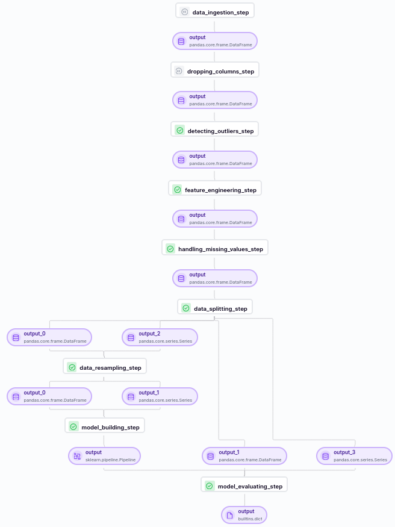
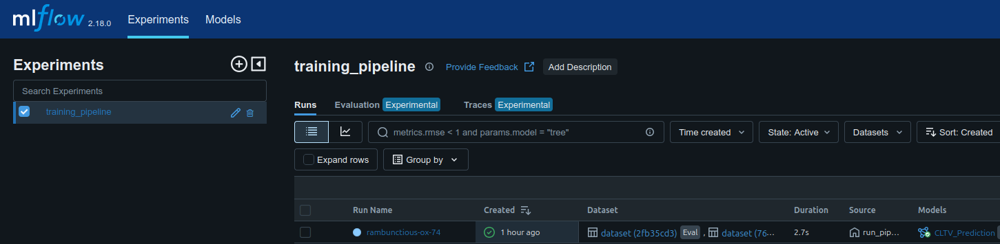
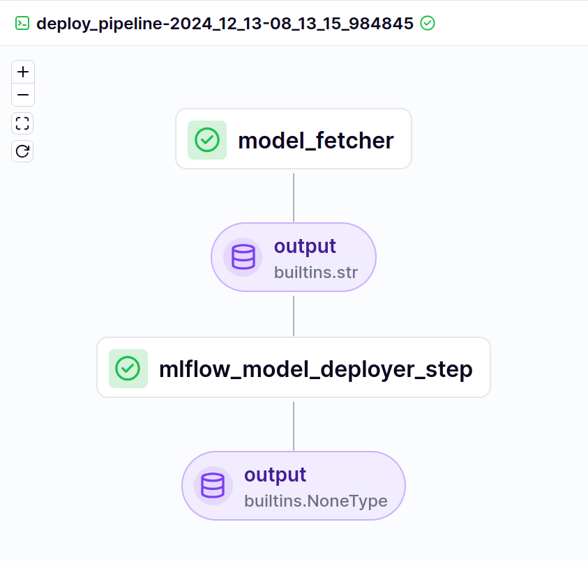
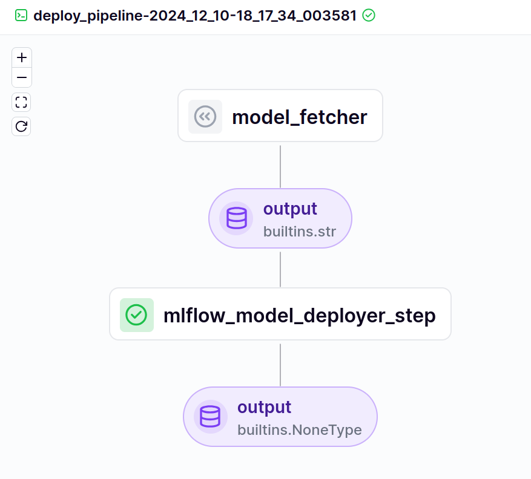

# Customer Lifetime Value Prediction MLOps Project

## Overview
This project implements a robust machine learning pipeline for predicting **Customer Lifetime Value (CLTV)** using ZenML. The goal is to estimate the long-term value of customers during their journey with the organization. The pipeline employs an **XGBoost Regressor** model, leveraging data from the [UCI Machine Learning Repository](https://archive.ics.uci.edu/ml/index.php). Key features of the project include:

- **Exploratory Data Analysis (EDA):** Conducted detailed EDA (available in the `data_analysis` folder), including feature selection and handling missing values.
- **Pipeline Automation:** Designed a ZenML pipeline with modular steps for training and deployment.
- **Experiment Tracking and Deployment:** Integrated **MLflow** for seamless experiment tracking and model deployment.
- **User Interface:** Developed a Flask application for interactive CLTV predictions.


---

## Prerequisites

To get started, ensure you have the following installed:

<<<<<<< HEAD
- **Python 3.10**
- **ZenML**
- **MLflow**

---
=======
Kindly clone this repository by using the following bash commands:
``` bash
git clone https://github.com/Kabyik-Kayal/Customer-Lifetime-Value-Prediction-MLOps.git
```
>>>>>>> d4226cf56b4ebf561adaf8162ee74518b544fb09

## Repository Structure

Here is a brief overview of the repository's contents:

- **`.vscode/`**: Contains workspace configurations.
- **`.zen/`**: ZenML configuration and metadata.
- **`data/`**: Includes raw data files.
- **`data_analysis/`**: Scripts and notebooks for exploratory data analysis.
- **`img/`**: Visual assets for the README or other documentation.
- **`materializer/`**: Custom materializers for ZenML pipelines.
- **`models/`**: Saved models for deployment.
- **`pipelines/`**: Pipeline definitions for ZenML.
- **`src/`**: Core source code.
- **`steps/`**: Modular ZenML steps for the pipeline.
- **`templates/`**: HTML templates for the Flask app.
- **`app.py`**: Flask application for user interaction.
- **`mlflow.db`**: MLflow database for tracking experiments.
- **`requirements.txt`**: Python dependencies.
- **`run_deployment.py`**: Script to trigger deployment pipelines.
- **`run_pipeline.py`**: Script to trigger training pipelines.

---

## Setup Instructions

### Clone the Repository

Clone this repository using the following command:

```bash
git clone https://github.com/Kabyik-Kayal/Customer-Lifetime-Value-Prediction-MLOps.git
```

### Environment Configuration

1. **Set up and activate your Python environment:**

    ```bash
    python3.10 -m venv myenv
    source myenv/bin/activate
    ```

2. **Install dependencies:**

    ```bash
    pip install -r requirements.txt
    pip install zenml["server"]
    ```

---

## ZenML Dashboard

To monitor pipelines and manage model-building steps, launch the ZenML dashboard:

```bash
zenml up
```

Log in with the default user credentials (no password required) and proceed to the next steps.

---

## ZenML Stack Setup

This project uses a local stack with the following components:

- **Local orchestrator**
- **Local artifact store**
- **MLflow experiment tracker**
- **MLflow model deployer**

Register and configure the stack using these commands:

```bash
zenml orchestrator register local_orchestrator --flavor=local
zenml artifact-store register local_artifact_store --flavor=local
zenml experiment-tracker register mlflow_tracker --flavor=mlflow
zenml model-deployer register mlflow_deployer --flavor=mlflow

zenml stack register local_stack \
    -o local_orchestrator \
    -a local_artifact_store \
    -e mlflow_tracker \
    -d mlflow_deployer

zenml stack set local_stack
```

Verify the setup:

```bash
zenml stack list
```

---

## Model Building Pipeline

The training pipeline in this project follows a structured, modular approach. Below are the detailed steps:

1. **Data Ingestion:**
   - Extract raw data from the source (Online Retail dataset).
   - Load data into a structured format for preprocessing.

2. **Handling Missing Values:**
   - Identify and fill or remove missing entries to ensure data consistency.

3. **Dropping Unnecessary Columns:**
   - Remove features that are not relevant to the CLTV prediction task.

4. **Detecting and Handling Outliers:**
   - Identify anomalous data points using statistical methods.
   - Apply transformations or filtering to mitigate their impact.

5. **Feature Engineering:**
   - Create new features that capture important customer behaviors.
   - Normalize and scale numerical features for model compatibility.

6. **Data Splitting:**
   - Partition the data into training and testing sets for unbiased evaluation.

7. **Data Resampling:**
   - Resamples the data using Bootstrap Resampling method.

8. **Model Training:**
   - Train an XGBoost Regressor model wrapped within a Scikit-Learn pipeline.
   - Utilize numeric preprocessors for optimal model performance.

9. **Model Evaluation:**
   - Assess the model using appropriate metrics like RMSE and R².

To run the training pipeline:

```bash
python run_pipeline.py
```
<<<<<<< HEAD
=======
As we run the python command we can see the model building process has started and different steps of the pipeline are being executed one after another from ingesting the data to feature engineering to spliting the data and then finally training the XGboost Regressor Model wrapped within a Scikit-Learn Pipeline along with numeric preprocessors. 
>>>>>>> d4226cf56b4ebf561adaf8162ee74518b544fb09

Once executed, the pipeline steps will be displayed in the ZenML dashboard:



> **Figure 1:** ZenML Training Pipeline Visualization

To monitor the experiment details, start the MLflow dashboard:

```bash
mlflow ui
```



> **Figure 2:** MLflow Experiment Tracking Dashboard

---

## Deployment

To deploy the latest trained model using the MLflow model deployer, run the deployment pipeline:

```bash
python run_deployment.py
```

<<<<<<< HEAD
This will initiate the deployment pipeline, as visualized below:



> **Figure 3:** ZenML Deployment Pipeline Visualization

---
=======

*Figure 3: Zenml Deployment Pipeline Visualization*
>>>>>>> d4226cf56b4ebf561adaf8162ee74518b544fb09

## Prediction

The project includes a Flask-based UI for predicting CLTV. Launch the Flask app:

```bash
python app.py
```
<<<<<<< HEAD

Input customer data through the UI to get predictions for their lifetime value.


> **Figure 4:** Flask Application for CLTV Prediction

---

## Key Features

- **End-to-End Automation:** From data preprocessing to model deployment.
- **Experiment Tracking:** Comprehensive tracking of experiments with MLflow.
- **Interactive Predictions:** User-friendly interface for real-time predictions.

---

For any issues or contributions, feel free to open an issue or submit a pull request. Thank you for exploring the **Customer Lifetime Value Prediction MLOps Project**!

This project is licensed under the MIT License.
=======
>>>>>>> d4226cf56b4ebf561adaf8162ee74518b544fb09
